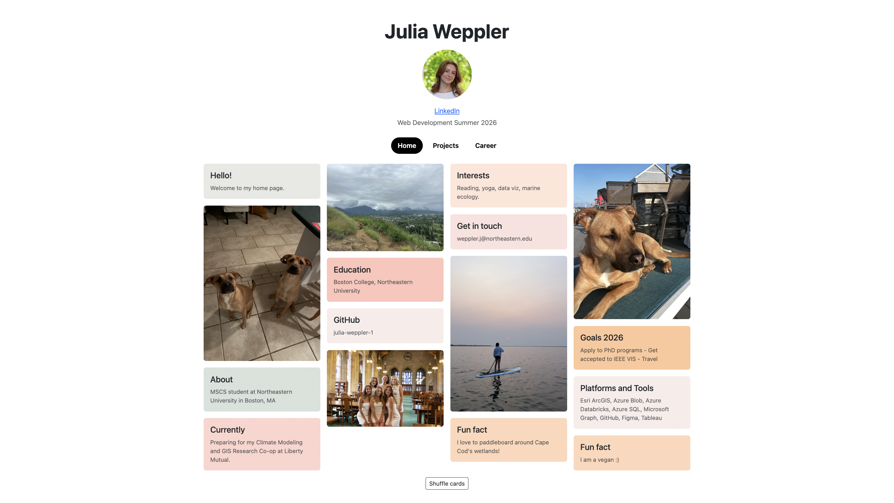
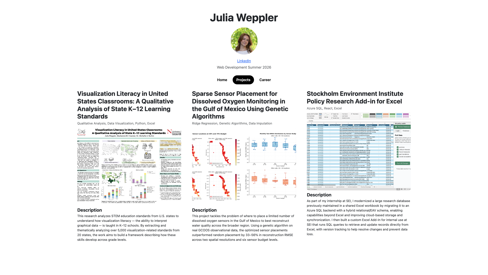
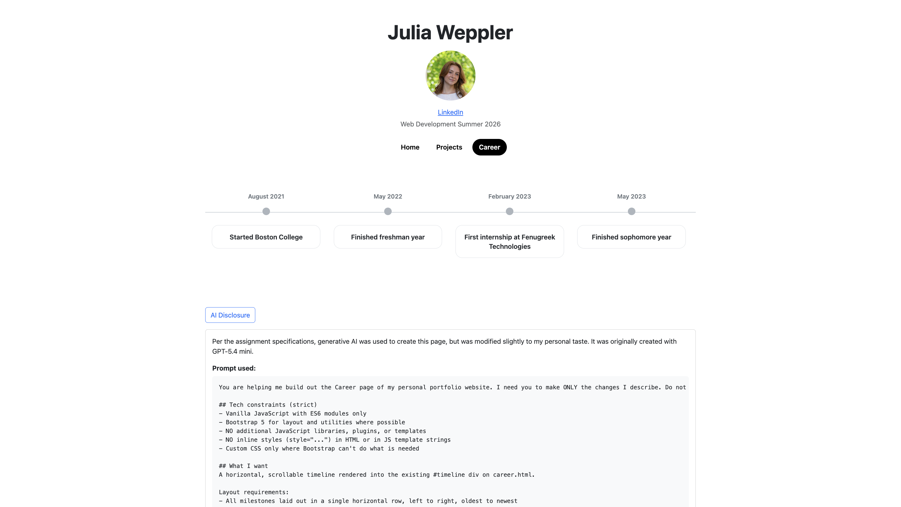

# cs5610-project1-homepage
This is my homepage listing my skills, courses, projects, and more for CS5610 Summer 2026. It features a Pinterest-style home board, a projects showcase, and a horizontally-scrollable career timeline.

GitHub Page: https://julia-weppler-1.github.io/cs5610-project1-homepage/

## Screenshot






## Demo
Watch my demo [here](https://youtu.be/FyQi3lPNgOc)
## Assignment Description
Per the assignment description on Canvas: "In this assignment you will be implementing your homepage using vanilla HTML5, CSS3 and ES6+. This should be a front-end only static page, so you shouldn't be using a backend or any components libraries. You cannot use jQuery, and all you JS code must be in ES6 modules. 

Also, remember that you need to provide a creative addition to your page, something that will differentiate it from every other page. It can be implemented using ES6+ or HTML+CSS alone if you wish. e.g. My homepage has a honeycomb grid of project images, where each image is a link that takes you to the project."

## Objective
- Practice ES6, HTML, and CSS/Bootstrap
- Build a responsive multi-page site using Bootstrap 5
- Demonstrate the use of generative AI to prototype and refine a page
- Separate data, rendering, and styling across files

## Tech Requirements
- HTML5
- CSS
- JavaScript (ES6)
- Bootstrap 5.3
- ESLint for code linting
- `reload` (or `http-server`) for local development

## Dev Tools Setup
This project uses ESLint for linting and `reload` for serving the site locally with live-reload. Both are installed via npm.

1. Make sure you have Node.js installed.
2. Install ESLint globally:
```bash
   npm install -g eslint
```
3. Install `reload` globally:
```bash
   npm install -g reload
```

## Pages
- **Home** — Pinterest-inspired board with text cards and embedded photos
- **Projects** — 3-column grid of project entries with click-to-expand thumbnails
- **Career** — Horizontally scrollable timeline of education, work, and research milestones, with hover-revealed details (AI-generated, modified to personal taste)

## Creative Addition
The home page features a shuffle button that reorders the cards into a new random layout, encouraging visitors to interact with the page and discover content in a different order each time. The career timeline complements this with hover-revealed milestone details, keeping the default view clean while offering progressive disclosure of the full story.

## How to Install & Use
1. Clone the repository:
```bash
   git clone https://github.com/julia-weppler-1/cs5610-project1-homepage.git
   cd ccs5610-project1-homepage
```
2. Run a local web server:
```bash
   reload -b
```
3. Open the URL printed in the terminal in your browser.
4. Navigate between Home, Projects, and Career using the pill nav.
5. On the Projects page, click any thumbnail to view it enlarged.
6. On the Career page, hover any milestone to see additional details.

## Course
Built for [CS5610 Web Development](https://johnguerra.co/classes/webDevelopment_online_summer_2026/) at Northeastern University.

## GenAI Use Disclosure

Per the assignment specifications, generative AI was used to create the Career page of this portfolio, but was modified slightly to my personal taste. It was originally created with GPT-5.4 mini.

### Prompt used

```
You are helping me build out the Career page of my personal portfolio website. I need you to make ONLY the changes I describe. Do not redesign other pages, restructure my files, or add features I didn't ask for.

## Tech constraints (strict)
- Vanilla JavaScript with ES6 modules only
- Bootstrap 5 for layout and utilities where possible
- NO additional JavaScript libraries, plugins, or templates
- NO inline styles (style="...") in HTML or in JS template strings
- Custom CSS only where Bootstrap can't do what is needed

## What I want
A horizontal, scrollable timeline rendered into the existing #timeline div on career.html.

Layout requirements:
- All milestones laid out in a single horizontal row, left to right, oldest to newest
- Container scrolls horizontally when content exceeds the viewport width
- Each milestone should have:
  - A date label (use the displayDate field)
  - A dot or marker sitting on a horizontal connecting line that spans the full timeline
  - A short title (use the title field)
  - An "extra info" detail (use the hover field) that is HIDDEN by default

Hover behavior:
- On hover over a milestone, the milestone expands to reveal the hover detail
- The expansion should feel smooth but I do NOT want fade/slide animations on the rest of the page, only the hover reveal itself
- Other milestones should not shift around dramatically when one is hovered (some shift is okay)

Responsiveness:
- The horizontal scroll behavior should work on desktop and mobile
- On very narrow screens, the horizontal layout can stay horizontal — do not collapse to vertical

## What to deliver
1. The updated career.js (full file)
2. Any new CSS rules to add to my existing styles.css (just the new additions, clearly marked)
3. Any needed changes to career.html (just the diff, not the full file)

## What NOT to do
- Don't touch index.html, projects.html, home.js, projects.js, or data.js
- Don't add npm, build steps, or package.json
- Don't introduce new HTML files
- Don't rename or restructure existing classes
- Don't add a "back to top" button, navigation arrows, scroll indicators, or any feature I didn't ask for
```

### Modifications made after generation
After the AI-generated code was produced, I made small refinements to better match my personal aesthetic:
- Adjusted the marker dot to sit directly on the connecting line (rather than above it)
- Recentered the date label above the dot
- Changed the marker color from blue to a muted gray to match the rest of the site

## Author
Julia Weppler
