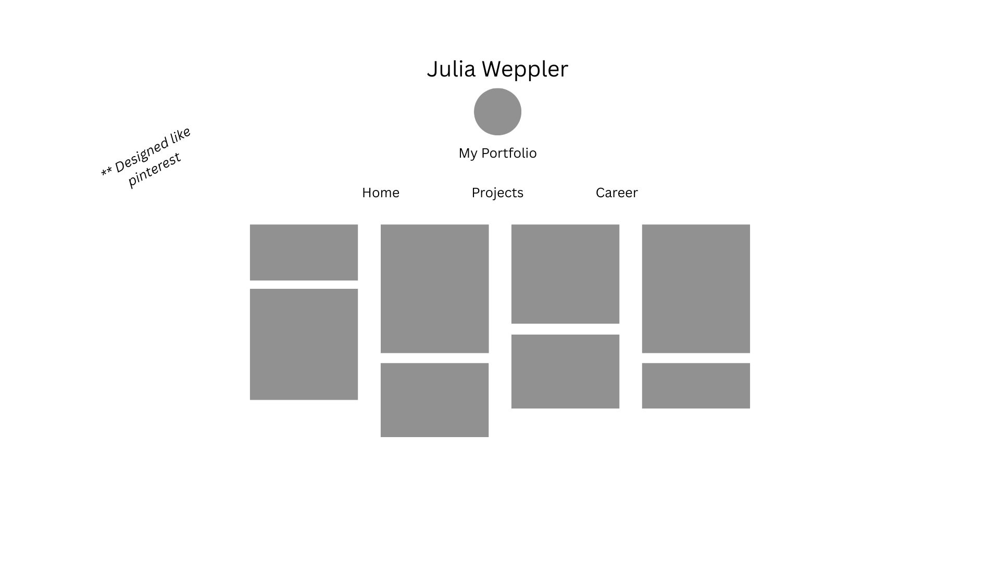
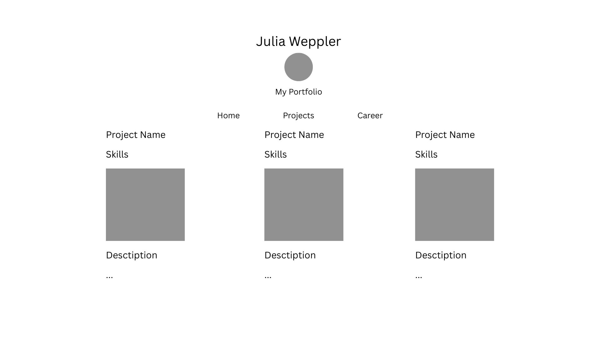
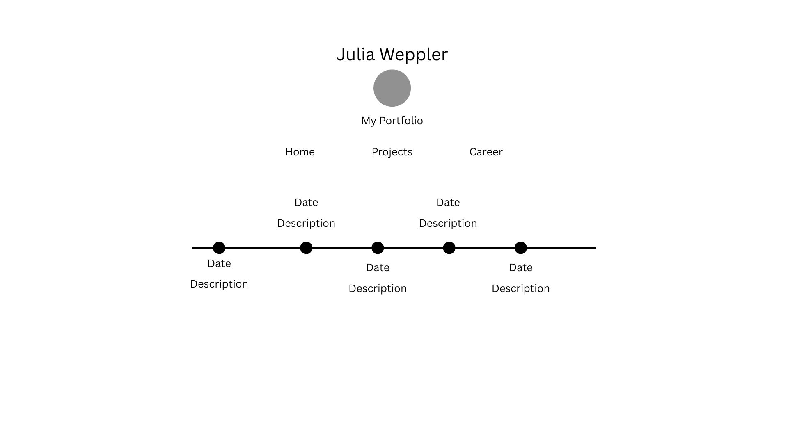

# Design Document

**Project:** Personal Portfolio Website
**Tech Stack:** ES6 + Bootstrap 5
**Author:** Julia Weppler

## Overview

A personal portfolio site built without a framework, using only ES6 modules and Bootstrap. The site has three pages: a Pinterest-board-style home page, a projects showcase, and an AI-generated career timeline. Navigation between pages happens client-side via a pill-style nav, with no page reloads.

## User Personas

### Persona 1: Professor and Teaching Assistants

- **Goal:** Gauge my understanding of course concepts for web development, specifically ES6 modules and Bootstrap.
- **Needs:** Code that demonstrates correct use of JavaScript and proper application of Bootstrap. They want to see that I understand the basics of front-end design, the box model, and Bootstrap's grid system. Also, that I know how to use GitHub and follow best practices for development and public code.

### Persona 2: Recruiters

- **Goal:** Evaluate my frontend design skills and learn what kind of work I've done.
- **Needs:** A strong first impression on the home page, a projects section that communicates what I built and what skills it used, and a quick way to understand my background.

### Persona 3: Students (Peers)

- **Goal:** Review my code, critique it, and identify styling or implementation patterns they might want to borrow.
- **Needs:** A predictable project structure following patterns and principles used in class.

## 3. User Stories

### Professor and TAs

- As a TA, I want to see ES6 modules used correctly, so that I can verify the student understands course principles.
- As a professor, I want to see Bootstrap classes used with custom CSS so that I can confirm the student is learning web design frameworks.

### Recruiters

- As a recruiter, I want to see the candidate's name and a brief overview as soon as the page loads, so that I know whose portfolio I'm looking at.
- As a recruiter, I want to browse projects with their tech stacks visible, so that I can match skills to open roles.
- As a recruiter, I want to see a career timeline, so that I can understand the candidate's experience quickly.

### Students

- As a peer, I want to find the styling in one place, so that I can reuse the design system in my own work.
- As a peer, I want to leave a critique on a specific component, so that the author can improve it.

## 4. Design Mockups

### Page 1: Home (Pinterest Board)

The landing page mimics a Pinterest board and displays quick facts and information about me. Cards vary in height to create the Pinterest staggered look. 

### Page 2: Projects

A 3-column grid of project cards. Each card stacks vertically: project name (bold, large), a one-line skills summary, a 4:3 screenshot, a "Description" label, and a longer paragraph describing the project and what was learned. The grid collapses to 2 columns under 1000px and 1 column under 640px.

### Page 3: Career Timeline (AI-Generated Layout)

A horizontally-scrollable timeline. Each milestone is a column with: date label, dot on the connecting line, short title, and info text revealed on hover. Hover enlarges the date, label, and icon, and slides the detail text into view below.

